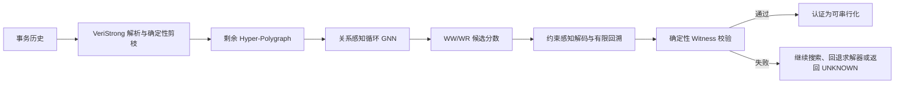

# VeriStrong 神经求解替代方案设计报告

版本：0.2  
范围：第一阶段只对应 VeriStrong 的 Serializability（SER）检测流程  
目标：使用图神经网络和约束感知解码器替代 VeriStrong 中成本较高的 SAT/SMT 搜索阶段

实施状态（2026-08-05）：阶段 A 的 Python 数据链路、VeriStrong model-only 导出/采集、阶段 B 的模型/损失，以及阶段 C 的约束解码与 witness 校验已经实现。上传的 Fig.10 共 102 条历史均已由 `fast + acyclic-minisat` 求解为 SAT，生成 156,715 个 WW 单解标签和 2,709 个 WR 单解组；所有标签均通过问题指纹、变量语义和独立 witness 校验。MiniSat assumption solving/backbone 导出仍属于后续工作。

## 1. 结论摘要

现有网络设计需要做一项关键修正：对于 VeriStrong，真正需要求解的变量不是通用的 `AR + WW`，而是：

1. `WW` 二选一：两个写事务在共享 Key 上选择一个版本顺序；
2. `WR` 多选一：一次外部读取从若干个写入相同 `(key, value)` 的候选事务中选择唯一来源。

`RW` 不是独立决策变量，而是由已经选择的 `WR + WW` 推导出来；`SO` 是历史直接给出的固定关系。因此，VeriStrong 版本的模型应采用 `WW 二分类头 + WR 分组分类头`，而不是当前的 `AR 二分类头 + WW 二分类头`。

推荐的替代方式不是直接让神经网络输出整个历史的 SAT/UNSAT，而是：



该方案可以在模型给出正确候选时完全跳过 SAT/SMT 求解，同时保留一个非常重要的性质：只有完整 assignment 经确定性检查满足所有选择约束且依赖图无环时，才输出“可串行化”。

需要明确的是：神经网络自身无法证明 UNSAT。若要求与形式化检测器相同的可靠性，候选失败不能直接判定历史不可串行化；必须执行完备搜索、生成可验证的 UNSAT 证明，或者回退到原求解器。

## 2. VeriStrong 当前流程与源码事实

### 2.1 历史格式

`history.bincode` 实际是 VeriStrong/DBCop 自定义的小端二进制格式，并非 Rust Serde Bincode。解析逻辑位于：

- `VeriStrong-main/veristrong/src/history/history.cpp`
- `VeriStrong-main/veristrong/src/history/history.h`

一个历史包含 Session、Transaction 和 Event。Event 字段为：

```text
is_write: 1 byte
key:      little-endian int64
value:    little-endian int64
success:  1 byte
```

解析器只保留成功 Event 和已提交 Transaction，并额外创建编号为 0 的初始事务，为每个已观察 Key 写入初始值 0。

### 2.2 有用读写事件

`constraints_of()` 不直接使用事务中的所有重复操作，而是使用：

- 每个事务对每个 Key 的第一次“写之前读取”；
- 每个事务对每个 Key 的最后一次写入。

这与技术报告中 `T ⊢ R(x,v)` 和 `T ⊢ W(x,v)` 的定义一致。数据生成器必须复用这套语义，不能简单把所有 Event 都转换为求解变量。

### 2.3 已知图

`known_graph_of()` 当前对 DBCop 历史首先建立 Transaction 节点及相邻 Session Order 边，然后提前返回。因此在未剪枝时，已知依赖图主要只有 `SO`。

运行 VeriStrong 的 `fast` pruning 后，一部分被强制的选择会转成已知边：

- 唯一候选产生的固定 `WR`；
- 排除一个方向后确定的 `WW`；
- 根据已确定 `WR + WW` 推导的 `RW`。

神经网络如果替代的是“剪枝后的求解阶段”，输入关系应使用剪枝后的已知图，而不是只使用最初的 SO 图。

### 2.4 WW 约束

对于在同一 Key 上发生最后写入的每对不同事务，VeriStrong 构造两个互斥方向：

```text
Ti --WW(keys)--> Tj
Tj --WW(keys)--> Ti
```

源码会把同一事务对共享的多个 Key 合并进一个 `WWConstraint`。求解时为两个方向分别创建布尔变量，并约束恰好一个方向成立。

因此第一版神经表示应当为“每个 WWConstraint 一个 Decision 节点”，用一个 logit 表示方向，而不是为每个共享 Key 重复创建互相独立的 WW Decision。

方向规范固定为：

```text
label = 1：left_transaction --WW--> right_transaction
label = 0：right_transaction --WW--> left_transaction
```

为保证不同机器和不同运行之间方向稳定，`left_transaction` 必须取较小的稳定事务 ID，不能依赖 C++ `unordered_set` 的遍历顺序。

### 2.5 WR 约束

对于读取事务 `Tr` 在 Key `k` 上读到值 `v` 的第一次外部读取，VeriStrong 找出所有最后写入 `(k,v)` 且不是 `Tr` 自身的事务：

```text
writers(k, v) = {Tw1, Tw2, ..., Twn}
```

然后要求下列 WR 候选恰好选择一个：

```text
Tw1 --WR(k)--> Tr
Tw2 --WR(k)--> Tr
...
Twn --WR(k)--> Tr
```

这不是一个方向二分类问题，而是一个可变长度的分组多分类问题。每个候选边可以对应一个 Decision 节点，但 loss 和解码必须按照 `wr_group_id` 做 grouped softmax。

候选数为 1 的 WR 约束无需交给模型，应直接变成 `WR_FIXED`；只有候选数大于 1 的 WR 组才是实际搜索变量。

### 2.6 RW 推导

若已经选择：

```text
Tw --WR(k)--> Tr
Tw --WW(k)--> Tnext
```

并且 `Tr != Tnext`，则必须产生：

```text
Tr --RW(k)--> Tnext
```

因此 RW 不能由模型独立预测。它必须由解码器按照 VeriStrong 的确定性规则推导，否则可能得到一个表面无环、实际不满足 dependency graph 定义的错误 assignment。

## 3. 当前真实样例的初步规模

已成功解析以下历史：

```text
VeriStrong-main/history/fig10/
20_10_15_5000_0.5_r_0.5_0.5_100/
hist-00000/history.bincode
```

剪枝前统计如下：

| 项目 | 数量 |
|---|---:|
| Session | 21（包含初始 Session） |
| Transaction | 201（包含初始事务） |
| 原始成功 Event | 3000 |
| 初始事务写入 | 2030 |
| 观察到的 Key | 2030 |
| SO 边 | 180 |
| WW 事务对约束 | 621 |
| WR 约束组 | 1522 |
| 单候选 WR | 1521 |
| 多候选 WR | 1 |

该样例表明，在部分 Fig.10 配置中绝大多数 WR 可以直接固定，神经搜索的主要负担可能集中在 WW。不同重复值比例配置下，多候选 WR 的数量会明显变化，后续必须对全部历史做分布统计，不能只根据单个样例决定损失权重。

## 4. 替代边界

第一阶段保留 VeriStrong 中确定性且相对廉价的部分：

1. 历史解析和 Int 检查；
2. Hyper-polygraph 构造；
3. unit/fast pruning；
4. WR + WW 到 RW 的推导；
5. 最终约束完整性和无环性校验。

替代以下部分：

1. SAT 变量选择；
2. WW/WR polarity picking；
3. 大量冲突驱动的组合搜索；
4. 常见 SAT 实例上的完整求解过程。

这样定义的“替代”更准确地说是：神经网络直接生成候选 witness，并由轻量确定性代码认证；只有候选失败时才需要搜索或回退。

## 5. 图数据设计

### 5.1 节点类型

建议从当前三类节点升级为四类：

| 节点类型 | 含义 |
|---|---|
| Transaction | 一个已提交事务，包括初始事务 |
| Key | 一个被成功操作访问的 Key |
| Decision | 一个 WW 方向决策或一个 WR 候选边 |
| Constraint | 一个 WW/WR 选择组，显式表达二选一或多选一约束 |

加入 Constraint 节点的原因是：多个 WR 候选并非独立二分类，它们属于同一个“恰好选择一个”的超边。将选择组 factor-node 化以后，同组候选可以在消息传递阶段直接交换信息，也为后续适配 PolySI 的其他约束类型保留统一接口。

若希望先保持三类节点，也可以暂时不物化 Constraint 节点，只在 batch 中保存 `decision_group_id` 并使用 grouped softmax；但四类结构更符合“替代求解器”而非“独立预测变量”的最终目标。

### 5.2 Transaction 特征

建议使用 16 维、全部可从历史和剪枝后已知图得到的特征：

```text
read_count
write_count
operation_count
distinct_key_count
session_position_normalized
session_length
so_in_degree
so_out_degree
wr_fixed_in_degree
wr_fixed_out_degree
ww_fixed_in_degree
ww_fixed_out_degree
rw_fixed_in_degree
rw_fixed_out_degree
known_ancestor_ratio
known_descendant_ratio
```

原草案中的 `scc_size` 和 `is_in_cycle` 不建议用于剪枝后的已知图：一个有效的已知图应为 DAG，因此这两个特征通常恒为 1 和 0。若需要 SCC 信息，应在“加入所有可能方向的辅助图”上计算，并明确命名为 `possible_graph_scc_size`，避免与已知依赖图混淆。

### 5.3 Key 特征

保持 6 维：

```text
reader_transaction_count
writer_transaction_count
read_count
write_count
access_count
contention_degree
```

其中 reader/writer count 应按事务去重，read/write count 按成功 Event 计数。初始事务的写入可以用于约束构造，但建议不要计入反映实际工作负载强度的 write_count；该规则需在训练和推理中保持一致。

### 5.4 Decision 特征

WW 和 WR Candidate 使用同一维度编码，但通过类型 one-hot 和关系类型区分。建议第一版采用 16 维：

```text
is_ww
is_wr
same_session
same_possible_scc
group_size
shared_key_count
left_known_degree
right_known_degree
has_known_path_left_to_right
has_known_path_right_to_left
session_position_delta
value_writer_count
left_writes_target_key
right_reads_target_key
constraint_occurrences
is_initial_transaction_involved
```

解释：

- 对 WW，left/right 表示两个候选写事务，`shared_key_count` 可以大于 1；
- 对 WR Candidate，left 固定表示候选 writer，right 固定表示 reader，目标 Key 唯一；
- `value_writer_count` 只表示相同值的候选写者数量，不直接编码被写入的具体 value；
- 所有 path、degree 特征只能基于当前已知边，不能包含 solver 最终 assignment。

### 5.5 Constraint 特征

建议 6 维：

```text
is_ww_group
is_wr_group
candidate_count
involves_initial_transaction
possible_cycle_count_capped
pruning_round_normalized
```

### 5.6 关系类型

固定依赖和访问关系：

```text
SO / SO_REV
WR_FIXED / WR_FIXED_REV
WW_FIXED / WW_FIXED_REV
RW_FIXED / RW_FIXED_REV
READS / READ_BY
WRITES / WRITTEN_BY
```

Decision 与实体关系：

```text
WW_LEFT / WW_LEFT_REV
WW_RIGHT / WW_RIGHT_REV
WR_WRITER / WR_WRITER_REV
WR_READER / WR_READER_REV
DECISION_KEY / KEY_DECISION
```

选择组关系：

```text
MEMBER_OF / HAS_MEMBER
```

每种关系继续使用独立 `Linear(hidden_dim, hidden_dim)`，每种关系内部做 mean aggregation，再跨关系求和。

## 6. 网络结构

编码器：

```text
TransactionEncoder: 16 -> 128
KeyEncoder:          6  -> 128
DecisionEncoder:     16 -> 128
ConstraintEncoder:   6  -> 128
```

Processor 保持当前设计：

```text
relation-aware mean aggregation
LayerNorm
GRUCell(128, 128)
FFN 128 -> 256 -> 128
residual + LayerNorm
共享参数循环 6 轮
```

### 6.1 WW 输出头

每个 WW Constraint 只有一个 Decision 表示，读取：

```text
[decision; left_txn; right_txn; left-right; left*right; constraint]
```

输出一个 logit：

```text
logit > 0：left --WW--> right
logit < 0：right --WW--> left
```

损失使用 `BCEWithLogitsLoss`。

### 6.2 WR 输出头

每个 WR 候选分别产生一个 score：

```text
[candidate_decision; writer; reader; writer-reader; writer*reader; key; constraint]
    -> MLP -> scalar score
```

对相同 `wr_group_id` 的候选做 grouped softmax：

```text
p(candidate | group) = exp(score_candidate) / sum(exp(score_in_same_group))
```

损失使用分组交叉熵，而不是逐候选 BCE。这样模型结构天然满足“同组概率和为 1”，并与 VeriStrong 的 WR 选择语义一致。

### 6.3 总损失

```text
L = L_WW + lambda_WR * L_WR
```

第一版可令 `lambda_WR = 1`，之后根据实际剩余 WW/WR 约束数量及梯度规模调整。不能仅依据剪枝前的约束数量设置权重，因为大量单候选 WR 会在剪枝后消失。

## 7. 标签生成

### 7.1 单个 Solver Model 的正确性边界

VeriStrong 的 Acyclic-MiniSat 内部保存 `S.model`，当前 model-only 构建会同时导出原始事务 ID 映射、变量理论语义和最终赋值。一次 SAT model 是一个经过完备求解器确认的合法 assignment，因此可作为正确的单解模仿标签；但同一个可串行化历史可能有多个合法 assignment，它不等价于唯一真值或 backbone。

若把任意解当作唯一真值，会造成：

- 相同结构可能被不同 solver seed 标成相反方向；
- 模型因对称解产生不必要的 loss；
- 决策准确率下降，但最终 witness 可能仍完全正确。

### 7.2 第一阶段标签

为快速打通链路，可先导出一个确定性 solver model：

- 固定变量和候选排序；
- 固定 solver seed；
- WW 导出所选方向；
- WR 导出所选 candidate index；
- 同时记录 `assignment_source = single_model`。

这组标签可用于正式的单解模仿训练，但决策 accuracy 必须按“相对所导出单解”解释，不能把不同但同样合法的 witness 计作求解错误。最终评估仍应以 witness 认证率和端到端求解时间为主。

### 7.3 Backbone 与可行集合标签

正式训练建议通过 assumption solving 计算：

WW：

1. 强制 left→right，检查是否仍 SAT；
2. 强制 right→left，检查是否仍 SAT；
3. 只有一个方向 SAT，则该 WW 为 exact backbone；
4. 两个方向都 SAT，则为歧义变量。

WR：

1. 对组内每个 candidate 分别强制为 true；
2. 记录所有仍可扩展为完整 SAT 解的 candidate；
3. 只有一个可行 candidate 时得到 exact backbone；
4. 多个可行 candidate 时保存 `feasible_candidate_mask`。

对于多解 WR 组，可使用集合监督：

```text
L_group = -log(sum(p(candidate) for candidate in feasible_set))
```

该损失不会惩罚另一个同样合法的候选。需要注意，逐组可行集合只能说明每个选择可以分别扩展为某个解，不能保证从不同组独立挑选的候选能组成同一个全局解，因此推理阶段仍需要约束感知解码。

### 7.4 建议修改的求解器接口

新增一个离线数据导出入口，例如：

```text
checker history.bincode \
  --pruning fast \
  --dump-neural-instance output.json \
  --dump-model \
  --compute-backbone
```

导出内容至少包含：

```text
原始事务和有用 Event
剪枝后的固定 SO/WR/WW/RW 边
剩余 WW 约束及稳定 left/right
剩余 WR 组及稳定候选顺序
一次完整 assignment
backbone_mask 或 feasible_candidate_mask
最终 SAT/UNSAT 状态
事务 ID 到连续局部编号的映射
```

JSON 适合调试和黄金样例；批量训练建议随后转为 `torch.save` 的扁平 Tensor 格式，以减少解析时间和磁盘体积。

## 8. 约束感知解码器

网络分数不能直接逐项阈值化。解码器必须维护当前已知图和选择组状态。

### 8.1 Top-1 快速路径

1. 对 WW 使用 sigmoid 置信度，对 WR 使用组内 softmax；
2. 按置信度从高到低处理选择组；
3. 尝试加入最高分候选；
4. 每次选择后执行 VeriStrong 相同的 RW 推导；
5. 增量检查是否形成环；
6. 若形成环，尝试该组的下一个候选；
7. 所有组完成后执行完整 witness 校验。

### 8.2 Beam/回溯路径

若贪心选择在后续遇到死路：

- 优先回溯低置信度选择；
- WR 保留 top-k candidate；
- WW 保留两个方向；
- 使用 beam score 累加对数概率；
- 每个扩展立即进行约束传播、RW 推导和环检测；
- 设置最大 beam width、扩展节点数和时间预算。

该过程利用模型减少搜索树，但不应重复实现一套与 VeriStrong 同样复杂的通用 CDCL。第一阶段目标是覆盖常见历史的快速 witness 构造。

### 8.3 最终 Witness 校验

校验器必须独立于神经模型，至少检查：

1. 每个 WW 组恰好选择一个方向；
2. 每个 WR 组恰好选择一个候选 writer；
3. 所有固定边都存在；
4. 所有要求的 RW 边均已正确推导；
5. 每个 Key 上的 WW 形成严格总序；
6. `SO ∪ WR ∪ WW ∪ RW` 无环。

通过这些检查的 assignment 是一个可验证的 serializable witness，因此“接受”结果不依赖模型可信度。

## 9. 正确性边界

| 输出路径 | 可以得出的结论 | 是否保持检测可靠性 |
|---|---|---|
| 神经 assignment 通过完整校验 | 存在兼容的无环 dependency graph | 是，可认证 SAT |
| 确定性 fast pruning 排除某组全部选择 | 不存在合法 assignment | 是，可认证 UNSAT |
| 神经 assignment 失败 | 该 assignment 不可行 | 不能据此推出 UNSAT |
| 有界 beam 全部失败 | 预算内未找到 witness | 只能返回 UNKNOWN |
| 回退原求解器返回 UNSAT | 不存在合法 assignment | 是 |
| 完备神经引导搜索穷尽全部分支 | 不存在合法 assignment | 是，但本质上仍是完整求解 |

因此推荐提供三态 API：

```text
CERTIFIED_SAT
CERTIFIED_UNSAT
UNKNOWN
```

若产品必须只有 accept/reject 两种输出，则 `UNKNOWN` 必须自动回退到 VeriStrong solver。

## 10. 数据集构建与划分

### 10.1 样本单位

一个完整历史是一条样本。禁止随机拆分同一历史中的 Decision 到训练集和验证集，否则 Transaction/Key 上下文完全共享，会产生严重数据泄漏。

建议划分：

```text
train: 70% histories
validation: 15% histories
test IID: 15% histories
test OOD-size: 更大 Transaction/Session/Event 配置
test OOD-workload: 不同读写比例、重复值比例和数据库来源
```

Fig.10 当前只有约 102 个历史，可以用于格式集成、消融和规模外初测，但不足以独立支撑稳健神经求解器训练。建议使用原工作负载生成器扩充到至少数千个 history，并确保包含足够的：

- 多候选 WR；
- 剪枝后仍未确定的 WW；
- SAT 与 UNSAT 历史；
- 不同图规模和冲突密度。

### 10.2 特征标准化

计数类特征先使用 `log1p`，再用训练集统计量标准化。比例和布尔特征保持 `[0,1]`。验证、测试绝不能重新拟合标准化参数。

### 10.3 防止标签泄漏

禁止把以下信息作为输入特征：

- 最终 MiniSat/MonoSAT assignment；
- solver 决策顺序；
- 最终拓扑序；
- 由最终选择产生的 WR/WW/RW 边；
- backbone 查询结果；
- 只有求解结束后才能得到的冲突次数。

允许使用剪枝阶段已经确定的边，因为部署推理时会运行同样的确定性剪枝。

## 11. 训练和评估

### 11.1 分变量指标

WW：

- backbone accuracy；
- AUROC、PR-AUC；
- Brier score 和 ECE；
- 不同置信度阈值下的准确率/覆盖率。

WR：

- group top-1 accuracy；
- group top-k recall；
- feasible-set hit rate；
- 按 candidate_count 分桶的准确率；
- ECE。

普通 decision accuracy 只能作为诊断指标，不能作为最终目标，因为多解 assignment 可能与导出的单一标签不同但同样正确。

### 11.2 图级核心指标

最终应报告：

```text
witness success@1
witness success@beam-k
certified SAT coverage
fallback rate
平均/中位/P95 端到端时间
解码扩展节点数
相对 VeriStrong 的加速比
峰值内存
错误 accept 数量（认证模式应为 0）
```

对 UNSAT 数据还需报告回退求解器时间是否因神经候选或冲突信息得到改善。

### 11.3 必做对照实验

1. 少量历史过拟合，确认数据和标签方向正确；
2. 打乱训练历史的标签，验证集结果应回落；
3. `processor_steps=0` 的 MLP 基线；
4. 去掉 Key 节点；
5. 去掉 Constraint 节点，只保留 grouped loss；
6. 去掉关系反向边；
7. Processor 轮数 `{2,4,6,8,10,12}`；
8. 单一 solver model 标签与 backbone/set-valued 标签对比；
9. 纯贪心、beam 和原 VeriStrong solver 对比；
10. 训练小图、测试大图的 OOD-size 实验。

## 12. 当前 Python 代码需要的调整

现有 `IsolationDecisionNetwork` 可以复用以下部分：

- 独立节点编码器；
- 逐关系 mean、跨关系 sum 的 Processor；
- GRU 状态更新；
- FFN 残差；
- 测试时覆盖 Processor 轮数。

需要修改：

1. `AR` 更名并重定义为 `WR Candidate`；
2. WR 从二分类头改成 grouped softmax；
3. `IsolationGraph` 增加 `decision_type`、`decision_key`、`constraint_group_id`；
4. 增加 Constraint 节点和对应编码器/关系；
5. WW 与 WR 使用不同 readout；
6. loss 支持 backbone mask 和 WR feasible-set mask；
7. 增加多图 batching 时的 group offset；
8. 增加约束感知 decoder 与独立 witness validator；
9. 增加 VeriStrong 导出数据的 loader。

不建议在这些改动完成前继续优化 hidden dimension、attention 或 Transformer，因为当前主要风险在求解变量语义和标签，而不在模型容量。

## 13. 面向 PolySI 等检测器的扩展接口

虽然第一阶段只实现 VeriStrong，数据层应抽象为统一的“带类型选择组的约束图”：

```text
build_instance(history) -> ConstraintGraph
choice_groups(graph) -> BinaryOrder | OneOfN | 其他类型
apply_choice(state, choice) -> derived_edges | conflict
validate_witness(graph, assignment) -> valid | invalid
```

VeriStrong adapter 提供 WW、WR 和 RW 推导；PolySI adapter 后续提供其版本序、读写依赖和 Snapshot Isolation 相关约束。GNN 主干可以共享，检测器差异主要封装在：

- 节点/关系类型；
- Choice Group 类型；
- 派生边规则；
- Witness 校验规则；
- 输出头及 grouped loss。

这比强行把所有检测器变量都命名为 AR/WW 更稳定，也更容易验证语义正确性。

## 14. 实施计划

### 阶段 A：真实数据链路

1. 给 VeriStrong 增加 model-only 导出与批量采集；
2. 导出剪枝前后图、WW/WR 约束和稳定 ID；
3. 建立一个黄金历史，对比 C++ 与 Python 的节点、边和约束统计；
4. 实现 PyTorch Dataset、batch collator 和特征标准化。

验收条件：随机抽取历史时，C++ 与 Python 的 SO/WR/WW/RW、WW group、WR group 数量和端点完全一致。

### 阶段 B：单解模仿模型

1. 从 MiniSat model 导出一次 assignment 并映射到稳定 group ID；
2. 实现 WW BCE 和 WR grouped cross-entropy；
3. 在少量历史上 overfit；
4. 完成 label shuffle、MLP 和轮数消融。

验收条件：真实数据训练 loss 可下降，图级 top-1 assignment 能通过独立 witness 校验。

### 阶段 C：可靠标签与解码

1. 增加 assumption solving；
2. 生成 WW backbone 和 WR feasible set；
3. 实现贪心、beam、增量 RW 推导和环检测；
4. 接入最终 witness validator。

验收条件：认证路径不存在错误 accept；在 held-out SAT 历史上达到有意义的 certified SAT coverage。

### 阶段 D：求解器替代评估

1. 测量神经推理、解码、校验和回退的端到端时间；
2. 与 VeriStrong `fast + acyclic-minisat` 比较；
3. 做规模外和工作负载外测试；
4. 决定部署模式：纯近似、三态输出或自动回退。

## 15. 主要风险与应对

| 风险 | 影响 | 应对 |
|---|---|---|
| 单一 solver model 标签存在任意性 | decision accuracy 被错误监督限制 | backbone/feasible-set 标签、多解采样 |
| 独立最高概率选择组合后冲突 | top-1 witness 失败 | 约束传播、增量环检测、beam/backtracking |
| Fig.10 图数量少 | 过拟合具体参数配置 | 扩充生成历史、按 history/config 划分 |
| 训练图小、部署图大 | 长距离依赖捕获不足 | 共享 Processor、测试时增加轮数、OOD-size 测试 |
| 神经网络错误宣告 UNSAT | 产生不可接受的误报 | UNSAT 必须回退或由完备搜索证明 |
| Python 重写与 C++ 语义漂移 | 训练图和实际检测图不一致 | C++ 权威导出器、黄金样例逐边比对 |
| unordered 容器造成方向不稳定 | 相同数据产生相反标签 | 所有事务、Key、候选和组统一排序 |

## 16. 最终建议

第一版应聚焦“VeriStrong SAT 快速路径”：保留构图和 fast pruning，模型预测剩余 WW/WR 选择，约束感知解码器生成完整 assignment，确定性校验器认证可串行化 witness。该路径最容易获得真实加速，也不会因为模型预测错误而错误接受一个历史。

在完成真实数据导出、稳定标签和 witness 校验之前，不应将任务表述为普通的 AR/WW 独立分类；那样虽然分类 loss 可以下降，但输出与 VeriStrong 的实际求解变量及约束不一致，无法真正替代求解阶段。
